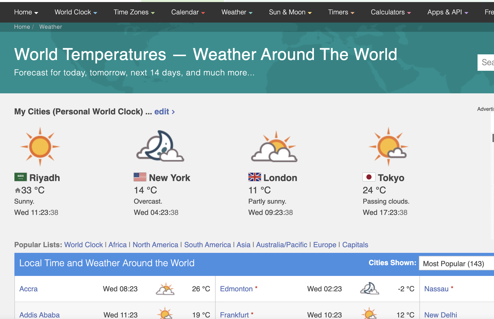

# Historical Weather Status for Saudi Arabia Cities

<br>

## Overview
Planning a vacation, trip, party or other events? Then you need to know how the weather affects your event.

The weather status is important as well for road safety, it affects directly the number of road accidents. The emergency department in every hospital takes in their consideration the weather status as well, they have a peak in their patients number in the seasonal time.

So knowing the weather status is important for several aspects of our life. Checking the weather forecast is easy if try it for next Tuesday, but what if you are planning a big outdoor wedding for spring 2022 or your class reunion for next winter?

Here we are trying to collect historical weather patterns for Saudi Arabia to be able to use it later in forecasting weather conditions that you can expect for any location and at any date, even one far into the future.

<br>


## Weather Data
We use this [weather website](https://www.timeanddate.com/weather/) to collect hourly weather data from **2017** to **2019** for all kingdom main cities:
- Qassim
- Hail
- Madina
- EP
- Riyadh
- Mecca
- Tabuk
- Assir
- Northern boarder
- Jazan
- Najran
- Baha
- Jawf



<br>

## Weather Scraper
Weather scraper is a python script for downloading weather status such as :
- Date
- Time
- Temperature
- Weather description ( clear - sunny - .... )
- Wind speed
- Humidity
- Barometer (atmospheric pressure)
- Visibility (how much be able to see or be seen)

-----

### Prerequisites
The requirements.txt file contains any Python dependencies. You can install them by running this command:

```
pip3 install -r requirements.txt
```

### Built With
-  [BeautifulSoup](https://pypi.org/project/beautifulsoup4/)  - Library to scrape information from web pages (HTML or XML parser).
- [selenium](https://pypi.org/project/selenium/) - Automated web browser interaction from Python

### Other Notes
If you're looking for the collected data in years 2017 - 2019 directly, you can find it without running this script uploaded as [Kaggle dataset](https://www.kaggle.com/esraamadi/saudi-arabia-weather-history)
